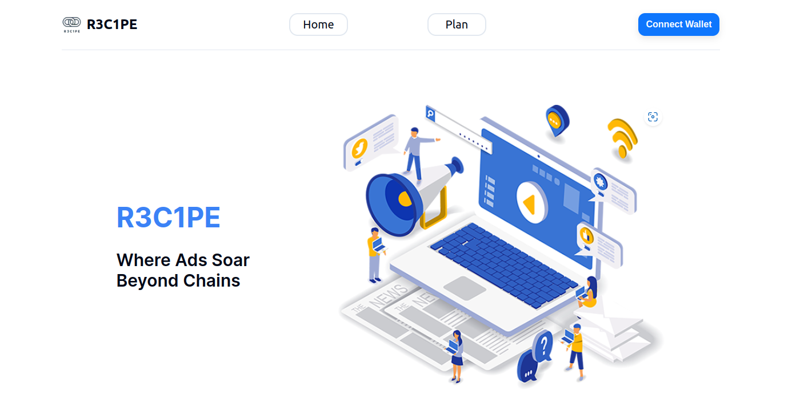

# R3C1PE - Where Ads Soar Beyond Chains - [Try Me Out](https://r3c1pe.vercel.app/)

## Introduction to R3C1PE $$

In a digital world saturated with conventional advertising, R3C1PE emerges as a beacon of innovation. We're transforming marketing by tapping into the boundless potential of blockchain technology. As a groundbreaking marketing platform, we're on a mission to bring transparency and effectiveness to advertising. Our platform unites businesses, dApp developers, and advertisers, facilitating secure, decentralized marketing campaigns powered by smart contracts and data analytics. In this comprehensive README, we'll dive deep into the core concept of R3C1PE, its mission, problem statement, innovative solutions, value propositions, roadmap, and how it intends to revolutionize and scale Ethereum to another level.

## Project Description 🌟

### Problem Statement 🗂️

#### 1. Lack of Transparency 🗃️

Advertisers often face issues with fraudulent traffic and impressions, leading to wasted advertising budgets. In web 2, this problem is exacerbated by a lack of transparency in the advertising supply chain, making it difficult to verify the legitimacy of ad views and clicks.

#### 2. Privacy Concerns and Data Security 👏

In both web 2 and web 3, there are growing concerns about user data privacy and security. Advertisers and marketing firms must navigate stringent regulations and address consumer apprehensions about data collection, handling, and sharing.

#### 3. Evolving Regulatory Landscape 💧

The regulatory environment is continuously changing in both Web 2.0 and Web 3.0. In Web 2.0, privacy regulations such as GDPR and CCPA affect how data can be used for targeting.

### Solution ⚙️

#### 1. Transparent advertising

Leveraging blockchain technology to ensure complete transparency in the advertising process. All transactions, engagements, and ad placements are verifiable through the blockchain, eliminating hidden costs and promoting trust.

#### 2. Decentralized Ecosystem

Providing users with an all-in-one platform for advertising on decentralized applications (dApps), where they can set their ads for maximum visibility and reach the entire blockchain community.

#### 3. Equitable access for advertising opportunity

Leveling the playing field for users of all sizes. This fairness encourages a diverse range of advertisers, fostering inclusivity and democratizing advertising within the platform.

### Value Proposition 🔥

Charify offers a range of compelling value propositions:

- **Cost-Efficiency and Eliminating Intermediaries**: With a one-time transaction, R3C1PE eliminates the need for costly intermediaries in the advertising process. Advertisers can enjoy all-inclusive advertising services without the burden of additional fees or middleman charges. This not only reduces the cost of advertising but also streamlines the entire process, making it more accessible and affordable for businesses of all sizes.

- **Equitable Opportunities and Fair Compensation**: R3C1PE is committed to fairness. We provide every user, whether a small business or a large enterprise, with equal opportunities to promote their products or services. Our revenue model, based on Clicks Per Minute (CPM), ensures that users are fairly compensated for the engagement their ads generate. This fosters a sense of equity and inclusivity, allowing advertisers to compete on a level playing field.

- **Transparency brings Trust**: R3C1PE introduces a level of transparency that is unprecedented in the advertising industry. By utilizing blockchain technology, we ensure that every transaction, engagement, and ad placement is recorded, auditable, and verifiable. This level of transparency builds trust among our users, as they can independently verify the effectiveness of their ad campaigns and trust that there are no hidden costs or deceptive practices in play.

### User Interface

- **Landing Page - Project Introduction and Knowledge Sharing**: The Landing Page serves as the gateway to the R3C1PE ecosystem, where users embark on an enlightening journey into our project. It is meticulously designed to offer a comprehensive understanding of our innovative advertising platform. This page provides a wealth of knowledge, including the core values, mission, and benefits of R3C1PE, ensuring that users are well-informed about the unique advantages of our system before proceeding.
- {landingpage.png}

- **Plans Page - Subscription and Customization**: The Plans Page stands as the bridge between users and the practical implementation of R3C1PE. This pivotal page empowers users to explore and select subscription plans tailored to their specific needs and objectives. It serves as the gateway to our advertising ecosystem, where users have the freedom to customize their advertising experience. The Plans Page facilitates a seamless, user-centric approach to subscription selection, ensuring that every user can choose a plan that aligns with their unique advertising goals.
- {burningpage.png}

- **Profile Page - Content Management and Personalization**: The Profile Page is the epicenter of user control and content personalization within R3C1PE. It empowers users with the tools and features necessary to curate and modify their advertising content. Here, users can exercise full control over their ad placements, content scheduling, and engagement strategies. The Profile Page ensures that users can dynamically adapt and fine-tune their advertising campaigns to suit evolving objectives and market dynamics, making it an indispensable resource for optimizing ad campaigns within our ecosystem.
- {governance.png}

## Roadmap 🚀

R3C1PE's roadmap outlines its strategic approach to provide a fair and transparency advertisement services dedicated for Web 3:

- **Multichain Integration**: Consider integrating with multiple blockchains and layer 2 solutions to improve scalability, cost-efficiency, and user choice.

- **Enhanced Data Analytics**: Implement advanced data analytics tools and machine learning algorithms to provide users with deep insights into ad performance and audience engagement.

- **Implement User-Generated Content Marketplace**: Establish a marketplace for user-generated content, allowing users to buy and sell ad materials and creative assets.

## Building Blocks 🏗️

To achieve its ambitious goals, R3C1PE will need to develop several key components:

### Tech Stack ⚙️

Charify leverages the following technologies and tools:

- **Package Manager**: `yarn`

- **Smart Contract Development**: `Solidity`

- **Deploy**: `Mantle deploy`

- **Network**: `Ethereum-testnet, Mantle-testnet`

- **Frontend**: `next`, `react`

- **Styling**: `tailwindcss, shadcn ui`

- **Linting & Formatting**: `eslint`, `prettier`

- **Design**: `eraser.io`

### Smart Contracts

- **AccountContract.sol**: This contract aligns with the EIP 2938 standard, enabling a designated owner to execute transactions to other addresses. It encompasses key functions including initialization (`constructor`), owner-restriction (`onlyOwner`), transaction execution (`executeTransaction`) authenticated through signature verification, and signer recovery (`recoverSigner`) from a given signature. Additional functionalities include designating a payer via `setPayer`, who will be responsible for gas fees, and allowing this payer to submit transactions to the network through `executeTransactionByPayer`, while the owner retains control over signing the transactions. This structure ensures a secure and flexible transaction management system, enabling an external payer to handle gas fees, thus alleviating the owner from this responsibility. It also provides utility functions `getOwner` and `getPayer` for fetching the addresses of the owner and the payer respectively.

- **AdIndex.sol**: This contract serves as an index for storing and managing advertisements, each associated with an IPFS hash for external content referencing. The core struct `AdInfo` encapsulates information about an individual advertisement, specifically its contract address and IPFS hash. The contract maintains an array `ads` to hold all indexed advertisements. Notable functions include `indexAd` for adding a new advertisement to the index, `removeAd` for deleting an advertisement from the index, and `searchAds` for retrieving all indexed advertisements. A helper function `findAdIndex` assists in locating the index of a specific advertisement within the array. Additionally, the contract emits events `AdIndexed` and `AdRemoved` to log the addition and removal of advertisements, respectively. Through this contract, users can efficiently index, remove, and search for advertisements, while associating them with IPFS hashes for decentralized content management.

- **Advertisements.sol**: This contract, developed on Solidity version ^0.8.20 and utilizing OpenZeppelin's `Ownable` and `ECDSA` libraries, serves as a decentralized platform for managing advertisements. The core of this contract is the `Ad` struct, which holds the essential details of an advertisement including its description, Cost Per Action (CPA) offer, active status, IPFS hash for decentralized file storage, and a timestamp marking its creation. The contract manages these advertisements through a mapping called `ads`, correlating advertisers' addresses to their respective `Ad` instances, and maintains a balance ledger `advertiserBalances` for tracking funds associated with each advertiser.

Key functionalities include registering, updating, and managing advertisements, alongside managing funds for advertisers. The `registerAd`, `updateAd`, `withdrawFunds`, `payCommission`, and `depositFunds` functions enable advertisers to interact with their ads and manage their funds on the platform. The contract also provides a mechanism for executing meta-transactions, a feature crucial for Account Abstraction, as per EIP 4337 and EIP 2893, through the `executeMetaTransaction` function. This function facilitates off-chain signings and on-chain executions, improving user experience and gas optimization.

Internally, the `_registerAd`, `_updateAd`, `_withdrawFunds`, and `_payCommission` functions encapsulate the logic for registering, updating, and financial transactions related to advertisements, ensuring a clean and secure interface for external interactions. The `getAdDetails` function allows for querying ad details, and `checkAdExpiry` is used to manage the lifecycle of advertisements based on their creation timestamps.

The contract emits several events such as `AdRegistered`, `AdUpdated`, `CommissionPaid`, and `AdExpired` to provide real-time feedback and transparency on the state changes within the contract, making it a comprehensive, self-contained solution for decentralized advertisement management with added features for modern Ethereum interactions through meta-transactions.

- **Auction.sol**: The Auction contract, built on Solidity version ^0.8.20, facilitates a straightforward auction mechanism on the Ethereum blockchain. It comprises a `Bid` struct for capturing individual bid details, and an array `bids` to store all bids. The auction's status is tracked via the `auctionEnded` boolean. The lifecycle begins with `startAuction` to initialize parameters, followed by participants placing bids through the `bid` function, ensuring the auction is ongoing. Upon conclusion, `endAuction` is invoked to mark the auction's end and allocate resources based on bids. For post-auction analysis, `getWinningBids` function allows retrieval of winning bids after the auction, ensuring transparency and fair bidding environment for participants.

- **IPFSHashGenerator.sol**: The `IPFSHashGenerator` contract, crafted on Solidity version ^0.8.20, acts as a comprehensive platform for creating, storing, and verifying IPFS hashes on the Ethereum blockchain. Through three distinct events: `HashGenerated`, `HashStored`, and `HashVerified`, the contract transparently logs the activities executed within it. It employs two mappings, `userHashes` and `hashRegistry`, as repositories to link addresses with their generated hashes and to keep a record of stored hashes, respectively. The `generateHash` function enables users to create a hash from a string input, which is then converted into an IPFS-styled hash and associated with the calling address. On the other hand, `storeHash` allows users to securely store a given IPFS hash, ensuring it hasn't been registered beforehand. With the `verifyHash` function, users can ascertain the validity of a specific IPFS hash against the stored hash linked to the calling address. Lastly, the `getHash` function avails a method to retrieve the hash associated with a particular address, encapsulating the contract as a versatile tool for managing IPFS hashes within a decentralized blockchain framework.

- **Referral.sol**: The `ReferralContract` is a Solidity contract designed to manage referrals within an advertisement system on the Ethereum blockchain. It enables the registration of referrers, generation of referral links tied to specific ads, recording of referral actions, and the withdrawal of commissions by referrers. Utilizing mappings, it keeps track of registered referrers, recorded actions, and the commission balances of referrers. Upon registration as a referrer, an event `ReferrerRegistered` is emitted. Referrers can generate a referral link associated with an advertisement contract and a specific ad using the `getReferralLink` function. When a referral action occurs, the `recordAction` function is employed to log the action, ensuring the referrer is registered and the action hasn’t been recorded previously, then updates the referrer's commission balance and emits an `ActionRecorded` event. Finally, referrers can withdraw their earned commissions through the `withdrawCommission` function, which ensures a positive commission balance before transferring the funds to the referrer. Through these features, the `ReferralContract` establishes a decentralized platform for handling and incentivizing referrals within a blockchain-based advertising ecosystem.

- **UserInteraction.sol**: The `UserInteraction` contract acts as an intermediary within a decentralized advertising ecosystem, facilitating user engagements with advertisements hosted on the Ethereum blockchain. This contract is tightly integrated with an `Advertisement` contract, from which it fetches the requisite advertisement details. On initialization, the address of the `Advertisement` contract is set, establishing a direct linkage. The primary function `interact` allows users to interact with an ad, which triggers an `AdInteraction` event capturing the ad owner, interacting user, and the IPFS hash of the ad content. This mechanism ensures that each interaction is transparently recorded on-chain. Additionally, there's functionality to retrieve the IPFS content hash of an ad through `getAdContentHash`, and to verify this hash with `verifyAdContentHash`, ensuring the integrity and authenticity of the ad content. 

Moreover, users can fetch complete details of an ad including its description, Cost-Per-Action (CPA) offer, active status, and IPFS hash through the `getAd` function. This contract also lays the groundwork for future enhancements. For instance, commented out functions hint at the ability to update ad content and fetch ad content from IPFS, albeit these actions are envisaged to be handled off-chain to maintain a lean on-chain footprint. This design reflects a forward-looking approach to developing a robust, decentralized advertising platform that can evolve with emerging needs and technologies, ensuring a user-friendly interface while adhering to the principles of transparency and verifiability inherent to blockchain technology.

## Explore R3C1PE 💭

R3C1PE invites you to explore a visionary frontier where innovation in advertising thrives. Discover the essence of our project: a dynamic fusion of blockchain transparency, cost-efficiency, and user-centric engagement that's redefining the future of marketing:

- **Transparency and Trust**: R3C1PE offers an unparalleled level of transparency in the advertising process. Every transaction, engagement, and ad placement is verifiable through blockchain technology, ensuring that users have full visibility into the effectiveness of their advertising campaigns. This transparency builds trust, as users can be confident that there are no hidden costs or deceptive practices. Advertisers can have complete trust in the integrity of the platform, making R3C1PE an ideal choice for those seeking transparent and trustworthy advertising solutions.

- **Cost-Efficiency and Fairness**: With a one-time transaction, R3C1PE eliminates the need for costly intermediaries and hidden fees. This cost-efficiency not only reduces the expense of advertising but also levels the playing field. Users, whether small businesses or large enterprises, have equal opportunities to promote their offerings and are fairly compensated based on engagement. R3C1PE's commitment to fairness ensures that every participant enjoys a fair and cost-effective advertising experience, making it an attractive option for businesses of all sizes.

If you have valuable feedback, innovative ideas, or a desire to contribute to the R3C1PE project, please don't hesitate to reach out on [GitHub](https://github.com/0xBenjamintan/ethklwinteam). Together, we can sculpt a crypto environment where empathy and intent steer positive transformation.

## Bounty Track

- ETHKL Hackathon Main Track - To develop a system which can scale and bring new innovation towards Ethereum ecosystem.
- Mantle Track, Best SocialFi or Consumer dApp - Hopes to provide Ethereum ecosystem with user-centric, financial empowerment, and social interaction.
- Taiko Track, Best dApp, Fun Track - R3C1PE aims to be one of the innovative and new ideas for bringing advertisement and marketing services onboard to web 3, which potentially become the best dapp among the scene.

## Conclusion

R3C1PE is poised to revolutionize the advertising and marketing landscape in the Web 3.0 era, offering unparalleled transparency, cost-efficiency, and user-centric engagement. As we venture into this exciting future, we invite users and businesses to join us in shaping a new advertising paradigm built on trust, fairness, and innovation. Together, we can redefine the way the world advertises, ensuring that every participant, regardless of size or budget, enjoys equal opportunities and a fair, cost-effective advertising experience. Welcome to the future of advertising with R3C1PE.
